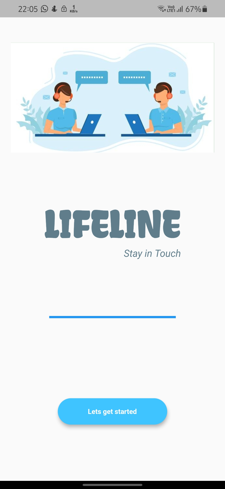
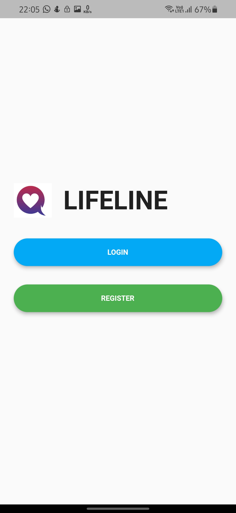
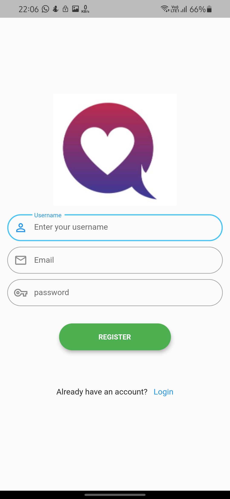
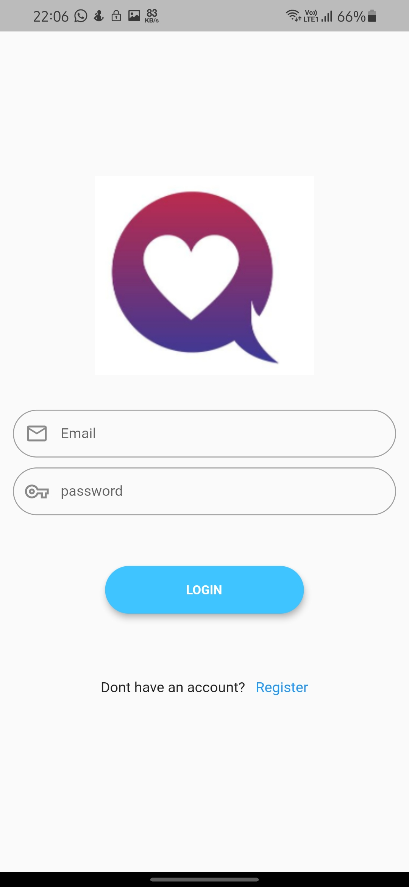

# lifeline

Messaging App

## GETTING INTO THE PROJECT:
The present world is moving towards the development of online services. In this context, the communication domain can be contributed by developing an online platform that can be used for direct communication among people from all over. This application allows users to chat with other users, view their profile. It also allow the users to update their profile, change password and delete account also.

This application is built on the flutter framework using Firebase as the backend and Cloud Firestore as the database.

This application has a Welcome page.
Fig 1 shows the Welcome page of our project.

Fig 1

The button Lets get started takes the user to the home page. If the user has already registered, click on login button otherwise click on registration button.
Fig 2 shows login-registration page.  
  
Fig 2  
  
Fig 3 and Fig 4 shows the UI of Registration page and Login page.  
<pre>             
Fig 3                                                    Fig 4  </pre>

