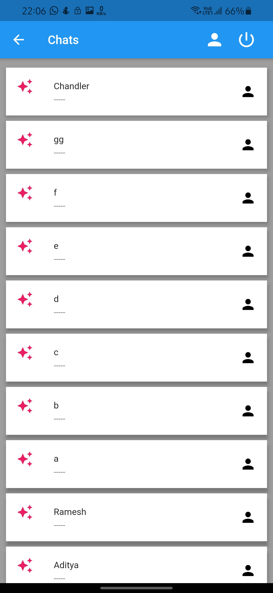
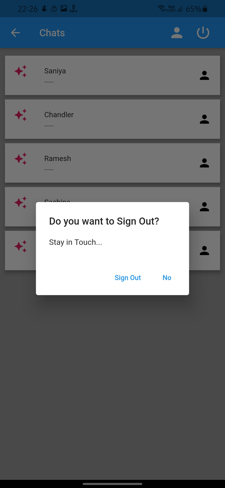
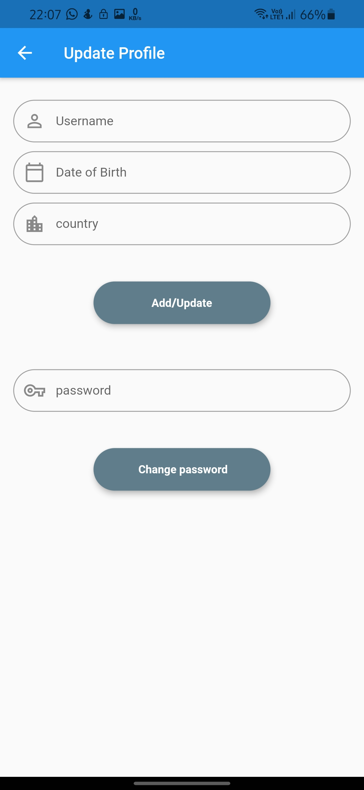
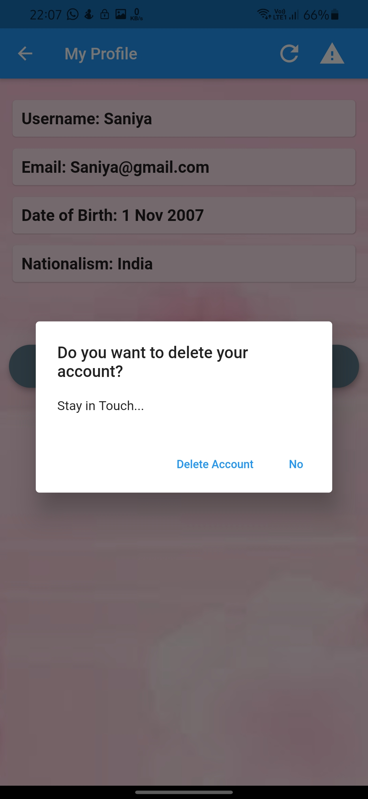
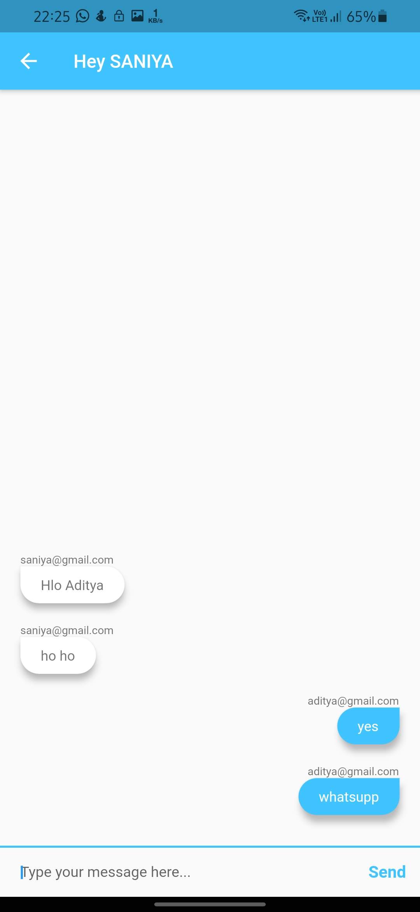

# lifeline 

Messaging App

## Requirement

-> Any IDE with Flutter SDK installed (ie. IntelliJ, Android Studio, VSCode etc)  
-> An Android Mobile Phone  

## How To Run

-> git clone https://github.com/Seven7teen/Lifeline---Flutter.git  
-> cd lifeline  
-> flutter run --release  

## GETTING INTO THE PROJECT:
The present world is moving towards the development of online services. In this context, the communication domain can be contributed by developing an online platform that can be used for direct messaging among people from all over. This application allows users to chat with other users, view their profile. It also allow the users to update their profile, change password and delete account also.

This application is built on the flutter framework using Firebase as the backend and Cloud Firestore as the database.

This application has a Welcome page.  
Fig 1 shows the Welcome page of our project.  

  
Fig 1  

The button Lets get started takes the user to the home page. If the user has already registered, click on login button otherwise click on registration button.
Fig 2 shows login-registration page.  
  
Fig 2  
  
Fig 3 and Fig 4 shows the UI of Registration page and Login page.  
<pre>             
Fig 3                              Fig 4  </pre>  

After clicking on register or login button, the user gets to the home page. All other users are listed on the home page. The user can select any of them to start direct chat.
Fig 5 shows home page.  
  
Fig 5  

The person icon on the top-right of the home page gets the user to his/her profile page. And the power icon on the right of it prompt the user to sign Out.  
Fig 6 shows my profile page and Fig 11 shows Sign out prompt.  
<pre>                   
Fig 6                             Fig 11  </pre>  

The update profile button on my profile page takes the user to update his/her profile and also change password.  
Fig 8 shows update profile screen.  
The danger icon on top-right prompt the user to delete account. Fig 7 shows the prompt.  
The refresh icon on left of it refreshes the details of the user when the details are updated.  

<pre>                   
Fig 8                             Fig 7  </pre>  

On the home screen, the person icon on the right of every other user takes you to their profile. One can be directly open chat page with that user by clicking on message icon in their profile.  
Fig 10 shows other user's profile.  
However by clicking on the particular user's box on home page, it directly takes the user to chat with that person on the chat page.  
Fig 9 shows the chat page.  

<pre>                   
Fig 10                             Fig 9  </pre>  

 

